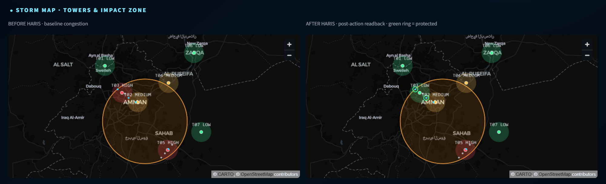
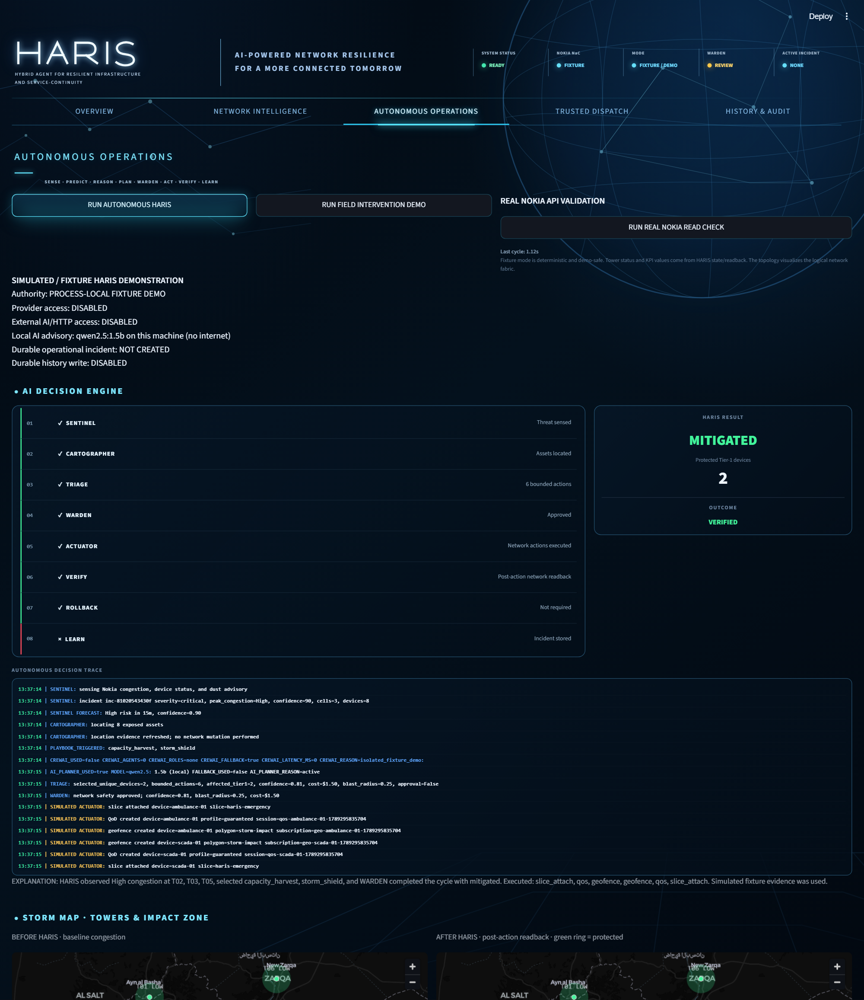
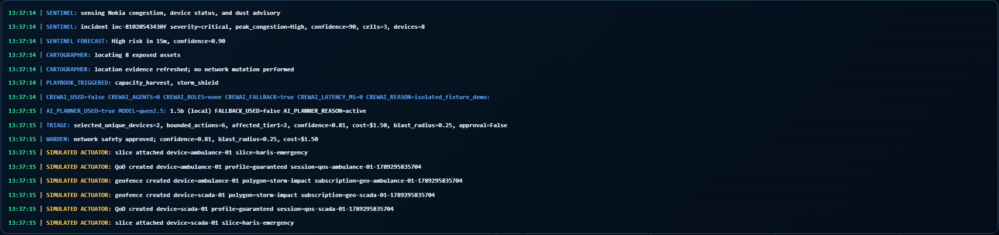
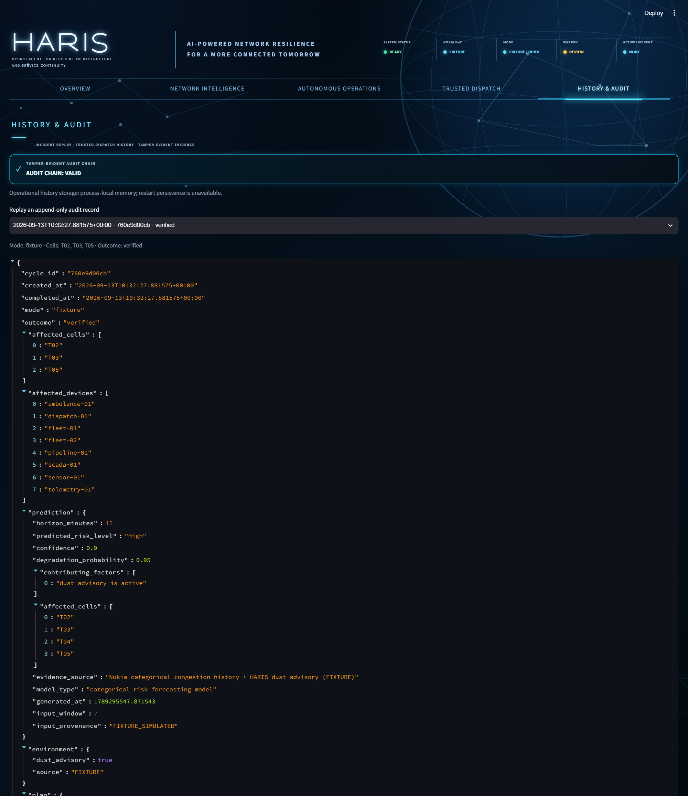

# HARIS

**Hybrid Agent for Resilient Infrastructure and Service-continuity**

HARIS is an autonomous, AI-assisted telecom resilience and network-operations system designed to preserve service continuity during congestion, sandstorms, extreme heat, and infrastructure stress.

HARIS was developed for the **GSMA MENA Ignite Hackathon 2026**, Theme 6: **Climate Resilience & Environmental Monitoring**.

The target safety-bounded operating loop is:

```text
Sense -> Reason -> Guard -> Act -> Verify -> Learn
```

HARIS is autonomous within defined policy authority. Capabilities that require unsupported controls, human consent, or operator resources remain explicitly bounded or unavailable rather than being presented as completed live operations.





<details>
<summary>More screenshots</summary>

| Simulated decision trace with optional local advisory | Tamper-evident audit chain |
|---|---|
|  |  |

</details>

## Evidence classification

All implementation and demonstration claims use the following labels:

| Label | Meaning |
| --- | --- |
| **REAL** | Directly demonstrated against real external infrastructure or an external integration, including Nokia Simulator where stated. |
| **DERIVED** | Transparently calculated from identified real evidence. |
| **SIMULATED** | Deterministic fixture or demonstration evidence. |
| **UNAVAILABLE** | Not currently available or not proven. |

SIMULATED and DERIVED evidence is never presented as REAL evidence. Missing live measurements remain unavailable; HARIS does not replace them with zero or fabricated values.

## Current architecture

```text
Streamlit supervisory dashboard
             |
             v
FastAPI authoritative backend
             |
             v
LangGraph deterministic supervisor
             |
             +--> CrewAI role-scoped advisory specialists
             +--> WARDEN deterministic policy and trust gate
             +--> Nokia Network as Code / CAMARA-compatible capabilities
             +--> bounded memory and retrieval
             +--> Supabase PostgreSQL durable state and audit history
```

| Layer | Current implementation |
| --- | --- |
| Frontend | Streamlit supervisory operations dashboard |
| Backend | FastAPI authoritative runtime and API boundary |
| Agent orchestration | LangGraph supervisor with deterministic workflow transitions |
| Advisory reasoning | CrewAI role-scoped specialists using configured Gemini or Groq providers; an explicitly enabled loopback Ollama model is an optional final advisor before deterministic policy |
| Telecom integration | Nokia Network as Code and CAMARA-compatible capabilities |
| Persistence | Supabase PostgreSQL durable event, incident, action, recovery, and audit state |
| Memory | Existing bounded operational memory and retrieval components; durable records remain backend-owned |

LLMs do not receive unrestricted Nokia mutation authority. External writes require the deterministic policy path and remain subject to runtime mode, resource configuration, and WARDEN approval.

## Multi-agent roles

HARIS defines five bounded operational roles:

| Role | Responsibility |
| --- | --- |
| **Sentinel** | Senses network, environmental, and incident evidence. |
| **Cartographer** | Correlates affected geography, towers/cells, devices, and critical assets. |
| **Triage** | Prioritizes impact and proposes bounded playbook actions. |
| **Actuator** | Executes only supported actions that WARDEN has authorized. |
| **Warden** | Owns deterministic network-safety policy and privileged-dispatch trust decisions. |

LangGraph supervises state and deterministic workflow transitions. CrewAI provides bounded, role-scoped advisory reasoning; its output cannot invent assets or measurements, bypass WARDEN, or directly execute Nokia actions.

## Local AI advisor (no internet required)

A local [Ollama](https://ollama.com) model can optionally provide advisory ranking without an Internet AI service. It is disabled by default and requires both `HARIS_LOCAL_LLM_ENABLED=true` and a loopback-only `LOCAL_LLM_BASE_URL`; the Windows launcher enables it only after detecting the configured model. The default model name is `qwen2.5:1.5b`.

- When explicitly enabled, it is the only AI advisor the isolated fixture demo may consult; by default that demo makes no AI or HTTP request.
- Loopback URLs only, so enabling it opens no outbound path.
- It is bounded exactly like the hosted models: it may only rank the candidate IDs TRIAGE supplies, it moves confidence by at most +/-0.05, and any invalid output falls back to deterministic policy. WARDEN still decides.

Demo behavior: when the optional advisor is enabled and returns a valid bounded ranking, the decision trace identifies the local model. Latency depends on operator hardware and model state; no performance benchmark is claimed.

## Closed-loop operations and playbooks

The operational graph follows:

```text
SENTINEL -> CARTOGRAPHER -> TRIAGE -> WARDEN -> ACTUATOR
         -> VERIFY -> ROLLBACK or LEARN
```

- **Storm Shield:** Correlates dust/storm evidence, meaningful categorical congestion, and exposed tier-1 assets; proposes QoD, protected-slice use where genuinely available, and policy-controlled geofence scope.
- **Capacity Harvest:** Uses sustained congestion and a configurable minimum tier-3 cohort to request lower-bandwidth QoD where supported. Upload deferral is recorded as a policy recommendation, not as an executed third-party upload control.
- **Energy Guard:** Uses timestamped observation history for low reserve plus sustained congestion, preserving emergency traffic while shedding eligible bulk traffic. Malformed or stale history fails safely.
- **Trusted Dispatch:** Runs only for privileged physical field intervention. Routine autonomous remediation does not invoke Number Verification or SIM Swap.

## WARDEN safety authority

WARDEN applies deterministic controls before any action, including:

- plan-confidence threshold;
- blast-radius limit;
- QoD spend controls;
- maximum protected devices per cycle;
- configured capability and operator-resource requirements;
- runtime-mode and live-write policy;
- post-action verification and recovery/rollback rules;
- recent SIM-swap blocking for privileged Trusted Dispatch;
- human escalation above defined safety boundaries.

Rollback and recovery operate only on HARIS-owned resources for the matching incident. Live writes fail closed when policy, evidence, ownership, or operator configuration is insufficient. Human intervention remains required outside HARIS's bounded authority.

## Seven Nokia / CAMARA capability groups

1. Congestion Insights
2. Device Status / Reachability
3. Location Retrieval
4. Geofencing
5. Quality on Demand
6. Network Slicing
7. Number Verification / SIM Swap

The seventh group supports WARDEN-owned Trusted Dispatch for privileged field intervention only.

## Verified Nokia / CAMARA integration evidence

| Capability | Evidence status | Demonstrated evidence and boundary |
| --- | --- | --- |
| Quality on Demand | **REAL_PARTIAL - Nokia Simulator** | The provider lifecycle reached `AVAILABLE`. Authoritative network verification was `UNCHANGED`; rollback cleanup was verified and the resource was absent. No network improvement is claimed. |
| Network Slicing | **PARTIAL REAL / SANDBOX-LIMITED** | An existing protected slice was retrieved and reached `AVAILABLE`. Activation remained in progress and did not reach `OPERATING`; HARIS correctly blocked live device attachment and failed closed. No successful live attachment is claimed. |
| SIM Swap | **REAL - Nokia Simulator** | Nokia integration returned real SIM-swap evidence. WARDEN consumed the result and blocked Trusted Dispatch when a recent swap was detected. |
| Geofencing | **Callback transport demonstrated / authentication unproven** | The Nokia-to-Render transport path was observed historically. The current callback fails closed because authenticated provider provenance is not proven. |
| Number Verification | **REAL - Nokia Simulator** | One positive end-to-end verification was demonstrated. A separate negative/unverified response remains negative; HARIS does not fabricate successful verification. |
| Trusted Dispatch | **REAL integration proof** | Engineer A completed Number Verification, a recent SIM swap was detected, WARDEN blocked release, and HARIS created the fallback Engineer B consent path. Engineer B completion is not claimed. |
| Congestion Insights | **REAL read-only / categorical where returned** | HARIS consumes available Nokia categorical congestion evidence. Unavailable numeric congestion, latency, and prediction values remain `N/A`. |
| Device Status / Reachability | **REAL read-only where returned** | HARIS consumes returned device reachability/status without inventing measurements. |
| Location Retrieval | **REAL read-only where returned** | HARIS uses returned positions only; unavailable coordinates are not fabricated. |

HARIS does not fabricate numeric radio signal, latency, battery, temperature, visibility, or probability measurements. Fixture values are explicitly labeled SIMULATED.

## Trusted Dispatch security flow

For a privileged field intervention, the FastAPI backend owns the complete security-sensitive workflow:

```text
FIELD_INTERVENTION_REQUIRED
-> engineer selected by policy
-> consent-bound Number Verification
-> server-side verification receipt
-> Nokia SIM Swap check
-> WARDEN ALLOW or BLOCK
-> fresh fallback engineer when permitted
```

The browser cannot supply authoritative `number_verified` or `recent_sim_swap` results. OAuth state, verification receipts, pending dispatches, and fallback binding remain backend-owned. Pending consent is an in-progress security state, not a failed network remediation.

## 5G/LTE and transport boundaries

Where no supported control API is exposed, 5G-to-LTE fallback remains a HARIS reasoning/recommendation capability. HARIS does not claim direct bearer switching.

Microwave-to-fibre steering remains roadmap work unless a genuine supported control integration is added and separately validated.

## Durable Persistence and Recovery

Supabase PostgreSQL is the durable source of truth for the Phase 6 runtime foundation. Persistence is backend-only and covers:

- domain events;
- network-state projections;
- incidents and incident transitions;
- actions and idempotency identities;
- resource ownership;
- verification and recovery state;
- inbound-event inbox;
- delivery outbox;
- workflow checkpoints;
- policy-cost ledger;
- append-only, tamper-evident audit history.

The audit chain uses canonical record content, `previous_hash`, and SHA-256 `record_hash`. It is tamper-evident and append-only; it is not described as cryptographically immutable or digitally signed.

Supabase secret/service-role credentials remain in backend environment configuration and are never provided to Streamlit or browser clients.

### Migration history

| Migration | Durable contract |
| --- | --- |
| **002** | Durable event/incident runtime schema and production RPC contract. |
| **003** | Explicit PT409 signaling for known domain conflicts. |
| **004** | Database-enforced operational versus integration-test outbox isolation. |
| **005** | Exact per-run integration outbox isolation with compatible worker ownership. |
| **006** | Recovery optimistic concurrency, monotonic transitions, and terminal-state protection. Applied and remotely verified. |
| **007** | Resource-lease generation and outbox-claim renewal/reclaim concurrency safety. Applied and remotely verified. |

### Real Persistence Restart Validation

Status: **`PERSISTENCE_RESTART_VALIDATED`**

| Verified property | Result |
| --- | --- |
| Process A durable persistence | PASS |
| Fresh Process B reconstruction | PASS |
| Incident identity stable | PASS |
| Resource ownership stable | PASS |
| SENT action reconstructed as `OUTCOME_UNKNOWN` | PASS |
| Reconciliation required | PASS |
| Duplicate incidents | 0 |

This proves that HARIS does not convert an unknown provider outcome after process failure into automatic success and does not automatically resend the uncertain action.

### Real Persistence Concurrency Validation

Status: **`PERSISTENCE_CONCURRENCY_VALIDATED`**

| Verified property | Result |
| --- | --- |
| Concurrent incident singleton | PASS |
| Incident ID convergence | PASS |
| Duplicate active incidents | 0 |
| Resource single owner | PASS |
| Resource conflict enforcement | PASS |
| Active resource owners | 1 |
| Event idempotency | PASS |
| Duplicate events | 0 |
| Inbox idempotency | PASS |
| Action idempotency | PASS |
| Duplicate actions | 0 |
| Optimistic version conflict | PASS |
| Stale write rejected | PASS |
| Outbox claim exclusivity | PASS |
| Outbox overlap | 0 |
| Exact-run outbox namespace isolation | PASS |
| Crash/replay safety | PASS |
| SENT -> `OUTCOME_UNKNOWN` | PASS |
| Reconciliation required | PASS |
| No action resend | PASS |
| No false success | PASS |

The real validation exercises database-level correctness through unique and idempotency constraints, partial active-incident uniqueness, transaction-scoped advisory locks, optimistic versioning, PT409 domain-conflict signaling, `FOR UPDATE SKIP LOCKED`, and exact integration-run namespace isolation. Python locks are not used to manufacture database correctness.

## Runtime modes

| Mode | Meaning |
| --- | --- |
| `fixture` | Deterministic SIMULATED evidence and operations for safe development and demonstration. |
| `live_read_only` | REAL observation where supported, with no network mutation. |
| `live_write` | Explicitly gated real mutation capability for supported and configured controls only. |

`NAC_MODE=live` maps safely to `live_read_only`. `live_write` is not assumed to be enabled: it requires explicit runtime policy and operator resource configuration. The scheduler is opt-in, non-overlapping, and requires the live-write loop gate before any supported mutation path can run.

## Offline safety verification

Latest complete offline-safe result:

```text
OFFLINE_TEST_TOTAL=690
PASSED=690
FAILED=0
ERRORS=0
OFFLINE_SAFE

EXTERNAL_NETWORK_ATTEMPTS=0
EXTERNAL_PROVIDER_CALLS=0
ORPHAN_HARIS_PROCESSES=0
ORPHAN_BACKGROUND_TASKS=0
```

The offline-safe suite is designed to prevent calls to Nokia, Supabase, OAuth, Gemini, Groq, Redis, weather services, and other external providers.

Run it with:

```powershell
.\.venv\Scripts\python.exe run_offline_tests.py
```

## Security boundaries

- Secrets remain in backend environment configuration; `.env` must never be committed.
- Operational FastAPI reads and controls require Bearer authentication. Configure `HARIS_OPERATIONAL_API_TOKEN` only on the backend and the matching `HARIS_BACKEND_API_TOKEN` only on the Streamlit deployment. Only minimal liveness/readiness routes remain public.
- The current bounded application rate limiter is per process (`PER_PROCESS_PROTOTYPE`); shared multi-instance rate limiting is not yet proven.
- Supabase secret/service-role credentials are backend-only.
- Nokia credentials and API tokens are never documented or exposed to frontend clients.
- OAuth codes, raw state, access tokens, client secrets, and consent-action tokens are excluded from status, trace, audit, and history.
- Sensitive phone numbers are masked in operator-facing dispatch state.
- Diagnostics use allowlisted metadata and do not expose raw upstream bodies.
- Live writes fail closed on unavailable evidence, configuration errors, policy rejection, provider errors, and uncertain outcomes.
- Integration-test records remain isolated from operational snapshots and user-facing live state.

## Current public components

- Streamlit supervisory frontend: <https://8eke73hh9xuxojhb3tabkh.streamlit.app/>
- Render FastAPI backend: <https://haris-0wjm.onrender.com>
- Repository: <https://github.com/Tamer-rum/HARIS.git>

No credentials, private endpoints, or environment data are embedded in these references.

## Local setup

### One click (Windows)

Double-click **`START-HARIS.bat`**. The first run creates `.venv`, installs the requirements and copies `.env.example` to `.env` (fixture mode, no credentials). The console then opens at <http://localhost:8501>; `STOP-HARIS.bat` stops it. If Ollama is running with `qwen2.5:1.5b` pulled, the launcher explicitly opts into the loopback-only local advisor and pre-loads the model (set `HARIS_LOCAL_MODEL` to use another one).

Console screenshots for the README and the deck: `python scripts/capture_screens.py` (Playwright with the local Chrome).

### Manual

```powershell
python -m venv .venv
.\.venv\Scripts\Activate.ps1
pip install -r requirements.txt
Copy-Item .env.example .env
python run_api.py
streamlit run app.py
```

Use `NAC_MODE=fixture` for deterministic local demonstrations. Configure `HARIS_BACKEND_URL` in Streamlit so the deployed console uses the authoritative FastAPI backend. Nokia, Supabase, OAuth, and reasoning-provider secrets belong only in backend hosting configuration.

## Demonstration paths

1. **Autonomous resilience:** SIMULATED storm -> congestion -> tier-1 prioritization -> WARDEN-gated QoD or truthful slice-degraded path -> verification -> learning and audit.
2. **Privileged field intervention:** explicitly SIMULATED physical-site evidence -> backend-owned Trusted Dispatch -> REAL Nokia consent/verification when invoked by an authorized tester -> SIM Swap -> WARDEN decision -> bounded fallback.
3. **Durable history:** inspect sanitized incident replay and tamper-evident audit-chain verification, including the verified Render restart persistence evidence.

## Current limitations

- Network Slicing is sandbox-limited: the existing protected slice did not reach `OPERATING`, so live device attachment was not forced.
- HARIS does not create new slices or geofence subscriptions as part of normal safe testing.
- Direct 5G/LTE bearer switching is unavailable without a supported control API.
- Microwave/fibre steering remains roadmap work.
- HARIS records upload deferral as policy/recommendation state; it does not claim control over a third-party application upload queue.
- Real writes remain explicitly gated and limited to supported, configured capabilities.

## Durable autonomous runtime status

**Phases 7A-7E are implemented and covered by OFFLINE_SAFE tests.** The controlled real Phase 7E QoD validation reached provider `AVAILABLE` under WARDEN and durable authority, but authoritative network verification was `UNCHANGED`. Cleanup was verified, the provider resource was absent, and the final result remains `REAL_PARTIAL`.

Implemented flow:

```text
push-first event ingestion
-> durable inbox/event
-> incident correlation
-> autonomous reasoning
-> WARDEN
-> action
-> verification
-> recovery
-> durable learning/audit
```

The Phase 6 durable foundation and its restart/concurrency proofs provide the persistence and concurrency guarantees used by this runtime. Polling remains the safe reconciliation fallback where push-first provider event support is unavailable.
